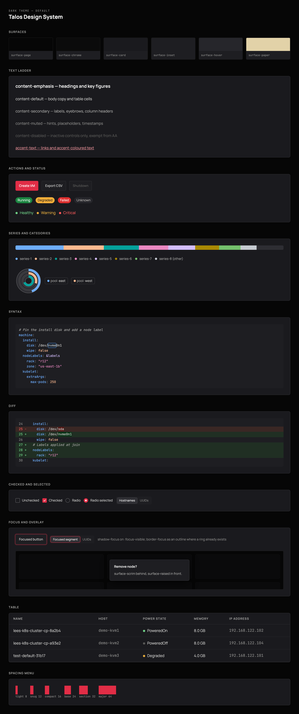
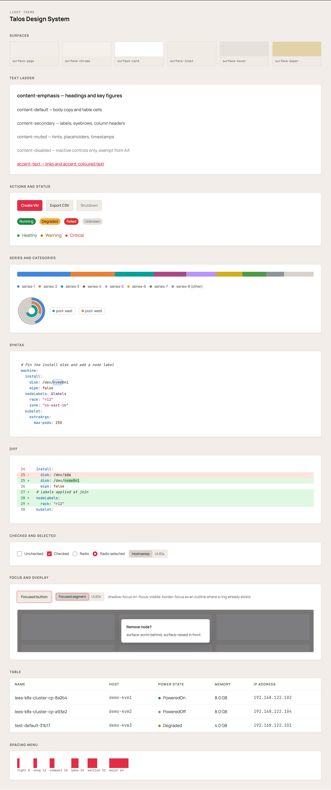

# Talos Design System

Design tokens, the rules for using them, and the lint that enforces them, shared by every Talos product interface and the documentation site. One source of truth in `tokens/`, compiled into CSS, Sass, Tailwind and JSON, with a contrast audit that fails the build when a pair falls below WCAG AA.

The values implement the Sidero brand visual guide. Where they depart from it, the style guide says so and says why.

| Dark, the default | Light |
| --- | --- |
|  |  |

Dim, an optional softer variant of dark, is described in the [style guide](docs/style-guide.md#dim). Open [`docs/preview.html`](docs/preview.html) in a browser to see the current build rendered in every theme. It reads `dist/tokens.css` directly.

## The rules

The system is written to be applied by an agent, so its rules are phrased as tests that can be run against a page rather than as taste. Eight of them explain most of what you will see. The rest, with the values and the exceptions, are in [`docs/style-guide.md`](docs/style-guide.md).

1. **Roles, not values.** Code names what a colour is for (`surface-card`, `content-muted`, `status-danger-text`), never a hex or a palette step. Themes swap underneath. ([The two-tier model](docs/style-guide.md#the-two-tier-model))
2. **Colour means status.** The pastel pill and the coloured word are reserved for a state someone might act on. Anything that is not a state (a version, a count, an ID, a label) loses both and is plain text or a neutral chip. ([What colour means](docs/style-guide.md#what-colour-means))
3. **Red is spoken for twice**, as the accent and as danger, so it is never decoration, never a chart series, never a syntax colour. Green and amber belong to success and warning for the same reason. ([Accent](docs/style-guide.md#accent), [Status](docs/style-guide.md#status))
4. **Categories are not states.** Things with no good or bad meaning (chart series, label groups) take the `series-*` palette, which leads with blue because nothing else in the system is blue. The test is whether a reader would want to act on the segment. ([Series and categories](docs/style-guide.md#series-and-categories))
5. **One colour per state, everywhere.** If scaling is amber in a status pill, it is amber in the chart above it. The pill is the reference, because it is where the word sits next to the colour. ([One colour per state](docs/style-guide.md#one-colour-per-state))
6. **Contrast is enforced by the build.** 4.5:1 for text, 3:1 for graphics, every theme, every pair. The one standing exception to the graphics floor is light-theme chart fills, held to 2:1 on the card because a legend or label always carries their value; a chart that relies on colour alone gets no exception. Every exception is listed in `build/contrast.mjs` with a reason, and adding one is an argument, not a way to quiet the check. ([Contrast exceptions](docs/style-guide.md#contrast-exceptions))
7. **Opacity fades an element, never a colour.** No brightness filters, no ad hoc alpha. A hover or pressed state re-points a role; a disabled composite fades whole. ([Text and icons](docs/style-guide.md#text-and-icons))
8. **A state has a shape as well as a colour.** Every status takes one of six glyphs (succeeded, failed, needs attention, in progress, off, unknown) and keeps its word. The test is whether the page still reads in greyscale. ([Iconography](docs/iconography.md))

Type has its own rules, in [`docs/type-roles.md`](docs/type-roles.md): every piece of text gets a role, and the role resolves onto the scale. Icons that carry meaning have theirs in [`docs/iconography.md`](docs/iconography.md).

## Adopting it in a product

Point an agent at this repository and ask it to bring the product onto the system. [`AGENTS.md`](AGENTS.md) is the procedure it follows: install at a tag, emit the tokens for the product's stack, serve the fonts from the product, map existing variables onto roles, give text its type roles, move spacing onto the menu, replace colour literals, turn on the lint. Each step ships on its own. The agent proves the result with `npx talos-audit`, which reads what the browser rendered and reports every value that matches no token.

To do the same by hand, or to understand what the agent is doing, [`docs/integration.md`](docs/integration.md) covers each stack: Tailwind v4, Bootstrap and Sass, Mintlify documentation sites, and plain CSS, plus the lint configuration and the audit.

A product that finds it needs a value the system does not have has found a token request, not a local override. Open an issue here.

## What a release contains

- **Tokens** in `dist/`: `tokens.css` (custom properties, dark under `:root`, light under `[data-theme="light"]`, dim under `[data-theme="dim"]`), `tokens.scss` (variables and mixins), `tailwind.css`, `tailwind-colour.css` and `tailwind-spacing.css` (Tailwind v4 `@theme` blocks, whole or by stage), `type.css` (type role classes), `fonts.css`, `mintlify.css` for the documentation site, and `tokens.json` with references and descriptions preserved.
- **Typefaces**: Manrope and JetBrains Mono, as dependencies on their Fontsource packages, so a self-hosted or air-gapped install serves them itself and never reaches for a CDN.
- **Migration**: `talos-migrate-spacing`, which renames Tailwind spacing utilities that are already on a step and lists the ones that are not.
- **Lint**: ESLint rules (`no-raw-color`, `no-raw-font-size`, `no-off-menu-spacing`, `no-primitive-token`) and a stylelint config.
- **Audit**: `talos-audit`, a Playwright runner that checks a rendered page against the scale, the menu, the typeface stacks and the active theme's roles, and flags status chips used as buttons and accent links standing alone in tables.
- **Docs**: the style guide, the type roles, the iconography guide, the integration guide, and the rendered preview.

## Versioning

Consumers take the package as a git dependency pinned to a release tag:

```json
"@siderolabs/talos-design-system": "github:siderolabs/talos-design-system#semver:^0.8.0"
```

Below 1.0 a caret range takes patch releases only: `^0.8.0` gets 0.8.1 but not 0.9.0. Moving to a new minor is a deliberate step, and [`CHANGELOG.md`](CHANGELOG.md) says what each release asks a product to change.

Tags are immutable. A released version never changes; a correction is a new tag. Renovate and Dependabot understand tagged git dependencies, so bumps arrive as ordinary bot PRs, and drift between products shows up as a version number rather than as a divergent hex. Nothing is published to npm; that can happen later or never without changing how consumers import anything.

## Contributing

Source is `tokens/`, hand-edited DTCG JSON. `dist/` is generated and committed; never edit it by hand. Run `npm install`, edit the source, run `npm run check` (build plus contrast audit) and `npm test`, commit `dist/` with the change, and open a pull request. Every change is reviewed by the code owner and lands as a version bump. The layout and commands are at the end of [`docs/integration.md`](docs/integration.md#working-on-this-repository).

## License and trademarks

Code and token definitions are MPL-2.0. The Sidero and Talos names, logos, and the visual identity these tokens describe are trademarks of Sidero Labs, Inc. The license grants no trademark rights: forking and modifying is welcome under the MPL, but nothing here licenses presenting derived work as Sidero's.
